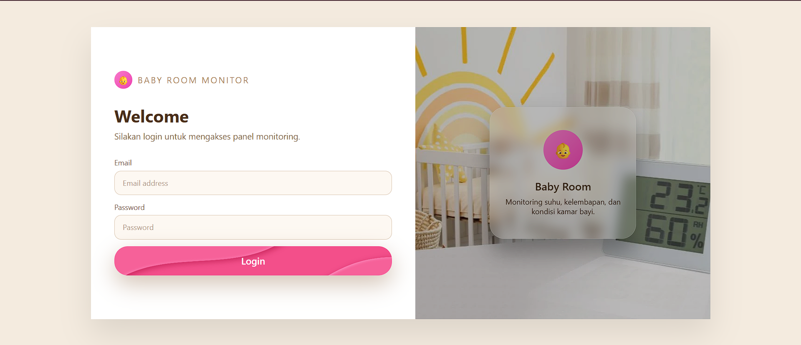
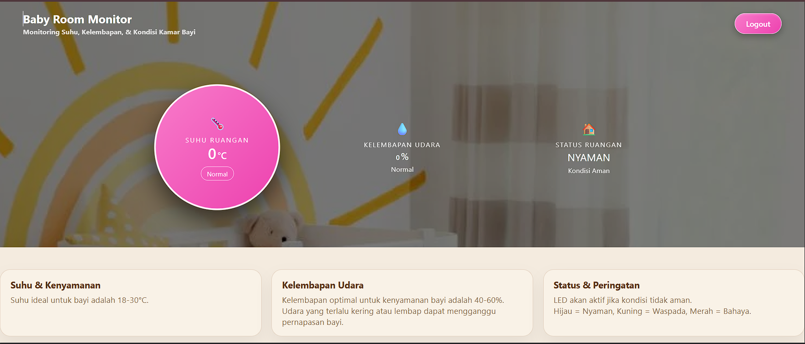

# 👶 Smart Baby Room Monitor

### IoT-Based Real-Time Monitoring System (ESP32 + Firebase)

Smart Baby Room Monitor adalah sistem berbasis **Internet of Things (IoT)** yang dirancang untuk memantau kondisi kamar bayi secara **real-time**, meliputi suhu, kelembapan, dan status kenyamanan ruangan.

Project ini mengintegrasikan **sensor lingkungan, ESP32, cloud database (Firebase), dan web dashboard** untuk memberikan solusi monitoring yang efisien dan otomatis.

---

## 🚀 Why This Project Matters

Bayi sangat sensitif terhadap perubahan suhu dan kelembapan.
Monitoring manual tidak cukup efektif karena tidak bersifat kontinu.

👉 Dengan sistem ini, pengguna dapat:

* Memantau kondisi ruangan secara real-time
* Mendapatkan status otomatis (Nyaman / Waspada / Bahaya)
* Mengakses data dari mana saja melalui web

---

## ⚙️ Key Features

* 🌡️ Monitoring suhu ruangan secara real-time
* 💧 Monitoring kelembapan udara
* 🏠 Status otomatis:

  * **Nyaman**
  * **Waspada**
  * **Bahaya**
* 🔄 Sinkronisasi data real-time (Firebase Realtime Database)
* 🔐 Sistem login (Firebase Authentication)
* 📊 Dashboard interaktif berbasis web

---

## 🧠 System Architecture

```text id="7vij5y"
DHT11 Sensor → ESP32 → Firebase Realtime Database → Web Dashboard
```

### Data Flow:

1. Sensor membaca suhu & kelembapan
2. ESP32 memproses dan menentukan status
3. Data dikirim ke Firebase
4. Dashboard menampilkan data secara real-time

---

## 🛠️ Tech Stack

### Hardware

* ESP32
* DHT11 Sensor
* LCD 16x2 I2C
* LED Indicator

### Software

* HTML, CSS, JavaScript
* Firebase Realtime Database
* Firebase Authentication

---

## 📁 Project Structure

```bash id="y3y2b3"
.
├── index.html
├── style.css
├── script.js
├── assets/
├── esp32/
├── docs/
├── screenshots/
└── README.md
```

---

## 🖥️ Live Demo

👉 https://aadnauj.github.io/UAS_IOT-Smart-Baby-Room-Monitor/

---

## ⚙️ How to Run

### 1. Setup ESP32

* Upload kode dari folder `esp32/`
* Pastikan WiFi & Firebase sudah dikonfigurasi

### 2. Run Web Dashboard

* Buka `index.html` di browser
  **atau**
* Gunakan GitHub Pages (Live Demo)

### 3. Login

```text id="g6unet"
Email: admin@mail.com  
Password: Admin123
```

---

## 📸 Preview

<p align="center">
  
</p>
<p align="center"><b>Login Page</b> — User authentication sebelum masuk ke dashboard</p>

---

<p align="center">
  
</p>
<p align="center"><b>Dashboard Monitoring</b> — Menampilkan suhu, kelembapan, dan status ruangan secara real-time</p>

---


## ⚠️ Important Notes

* Firebase config digunakan untuk keperluan demo
* Untuk production, gunakan environment variable
* Pastikan Firebase Rules dikonfigurasi dengan aman

---

## 📈 Future Improvements

* Push notification (mobile)
* Integrasi kontrol otomatis (kipas / humidifier)
* Penambahan sensor (kualitas udara)
* UI/UX enhancement

---

## 👨‍💻 Contribution

Kontribusi utama dalam project ini:

* Pengembangan web dashboard (HTML, CSS, JS)
* Integrasi Firebase (Authentication & Realtime DB)
* Implementasi alur data IoT
* Pengujian sistem secara end-to-end

---

## 📌 Conclusion

Project ini menunjukkan implementasi lengkap sistem IoT, mulai dari **data acquisition (sensor)** hingga **real-time visualization (web dashboard)**.

---

## 📄 License

This project is intended for educational and portfolio purposes.
